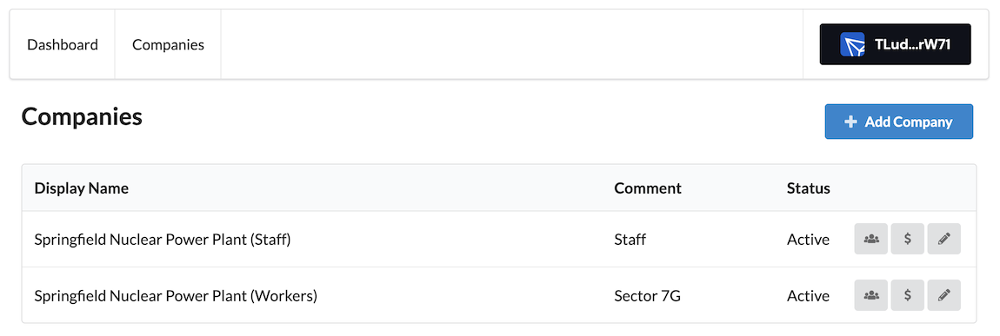
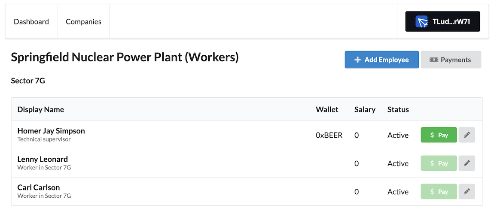
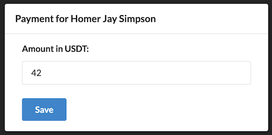

# Web3: Employment

We are looking for 2-3 experienced software developers to join our team and help
us build a web-based system for managing companies and employees.

The ideal candidates will have expertise in Next.js, ReactJS, TypeScript,
PostgreSQL, [Prisma.io](http://prisma.io/), Docker,
[React Semantic UI](https://react.semantic-ui.com/), and experience with writing
tests. We will be using [Zod](https://zod.dev/) library for backend to validate
requests. In addition, it would be great if you have experience with the web3
stack and working with crypto wallets and transactions on Tron blockchain.

Payments for this project will be processed on a weekly basis using Tron USDT.
We are looking for developers who can work together, split tasks and contribute
to this project. By joining our team, you will be listed as a developer and can
use this project to enhance your resume.

This is a remote position and we are looking for candidates who can work with us
full-time or part-time. If you are passionate about developing high-quality
software and working on a dynamic team, please apply and join us on this
exciting project.

## Overview

The app is a web-based system for managing a list of companies and their
employees. There will be only one user of this app, so we don’t need a
registration/authorization system.

It will be built using Next.js, PostgreSQL as the database, Prisma as the
database connector, Zod as a validation library for Backend API, React Semantic
UI as a design system, and TronWallet Adapters to process payments. The system
will allow you to create companies and add employees to them. Additionally, the
system will support making payments to employees using cryptocurrencies and
archiving/unarchiving companies and employees.

## Screenshots

### Companies List



### Employees List



### Add New Employee


### Pay Salary



## Features

### Create Company

The app should allow you to create new companies using pop-up dialog. When
creating a new company, you should provide a display name for the company and a
comment. The backend should validate that the display name is not an empty
string, and return an appropriate error message if the validation fails.

Page: `/companies`

API endpoint: `POST /api/companies`

Body:

```json
{
  "display_name": "Springfield Nuclear Power Plant",
  "comment": "Sector 7G"
}
```

### List Companies

The app should display a list of all companies that have been created,
including their display names, comments, and status. The status can be either
active or archived, and it would be great to have a filter option to show all
companies, only active companies, or only archived companies. In addition, for
each company, the list should include action buttons to archive/unarchive the
company and edit their details.

Page: `/companies`

API: `GET /api/companies?status=active|archived|all`

Body:

```json
{
  "companies": [
    {
      "id": "a8496aed-8bb4-4be1-988c-ac33a347d950",
      "display_name": "Springfield Nuclear Power Plant",
      "comment": "Sector 7G",
      "status": "active"
    }
  ]
}
```

### View Company Details

The app should allow you to view the details of a specific active company,
including its display name, comment, and a list of employees associated with the
company. The list of employees should display their display name, contacts,
status, and wallet address. In addition, for each employee, the list should
include action buttons to archive/unarchive the employee, edit their details,
and make a payment (using pop-up dialog).

Page: `/companies/:id`

API: `GET /api/companies/:id`

Body:

```json
{
  "company": {
    "id": "a8496aed-8bb4-4be1-988c-ac33a347d950",
    "display_name": "Springfield Nuclear Power Plant",
    "comment": "Sector 7G",
    "status": "active"
  },
  "employees": [
    {
      "id": "54f1c72f-274a-42a5-9fc7-0f80438a32a3",
      "display_name": "Homer Jay Simpson",
      "contacts": "Homer_Simpson@AOL.com",
      "wallet_address": "0xDEADBEEF",
      "status": "active"
    }
  ]
}
```

### Create Employee

The app should allow you to create new employees and assign them to a company
(using pop-up dialog). When creating a new employee, you should provide a
display name, contacts (using textarea field), and a blockchain wallet address.

Page: `/companies/:id`

API: `POST /api/companies/:id/employees`

Body:

```json
{
  "display_name": "Homer Jay Simpson",
  "contacts": "Homer_Simpson@AOL.com",
  "wallet_address": "0xDEADBEEF",
  "contacts": "Homer_Simpson@AOL.com"
}
```

### Edit Company Details

The app should allow you to edit the display name and the comment of a company.

Page: `/companies/:id`

API: `PUT /api/companies/:id`

Body:

```json
{
  "display_name": "New Company Name",
  "comment": "A few words"
}
```

### Edit Employee Details

The app should allow you to edit the details of an employee, including their
display name, contacts, and blockchain wallet address.

Page: `/companies/:id`

API: `PUT /api/companies/:id/employees/:employee_id`

Body:

```json
{
  "display_name": "New display name",
  "contacts": "New contacts",
  "wallet_address": "0xEEE"
}
```

### Archive Company (Soft Delete)

The app should allow you to archive a company from the companies list. This
action will change the status of the company to “archived”.

Page: `/companies`

API: `DELETE /api/companies/:id`

### Unarchive Company

The app should allow you to unarchive a company from the companies list. This
action will change the status of the company to “active”.

Page: `/companies`

API: `POST /api/companies/:id/unarchive`

### Archive Employee

The app should allow you to archive an employee from the company’s card. This
action will change the status of the employee to “archived”

Page: `/companies/:id`

API: `DELETE /api/companies/:id/employees/:employee_id`

### Unarchive Employee

The app should allow you to unarchive an employee from the company’s card. This
action will change the status of the employee to “active”.

Page: `/companies/:id`

API: `POST /api/companies/:id/employees/:employee_id/unarchive`

### Make Payment

The app should allow you to make payments to employees using cryptocurrencies.
You should be able to specify the amount in USDT for the payment. Payments
should not be available if company or employee are archived.

Page: `/companies/:id`

API: `POST /api/companies/:id/employees/:employee_id/pay`

Body:

```json
{
  "transaction_hash": "0x1234",
  "amount": 123,
  "wallet_address": "0xEEE"
}
```

## Database

[Here is the current schema](https://github.com/optriment/web3-employment/blob/main/prisma/schema.prisma)
for Prisma.

## Timeline & Sprint Planning

### Sprint 1

- [x] Create project structure and set up linters
- [x] Create and test database schema using Prisma
- [x] Set up GitHub workflow actions for automated testing and deployment
- [x] Create a Docker container with docker-compose and provide a Makefile

### Sprint 2

- [x] Create API endpoint to create a company with display name and validate input
- [x] Create frontend UI to create a company
- [x] Write test cases for creating a company and validating input
- [x] Create API endpoint to list all companies with their display names and status
- [x] Create frontend UI to display all companies
- [x] Write test cases for listing all companies

### Sprint 3

- [x] Create API endpoint to add an employee to a specific company
- [x] Create frontend UI to add an employee to a specific company
- [x] Write test cases for adding an employee to a company
- [x] Create API endpoint to list all employees in a specific company
- [x] Create frontend UI to display all employees in a specific company
- [x] Write test cases for listing all employees in a specific company

### Sprint 4

- [x] Create API endpoint to make a payment for an employee
- [x] Create frontend UI to make a payment for an employee
- [x] Write test cases for making a payment for an employee
- [x] Write documentation on how to run the project locally

### Sprint 5

- [x] Create API endpoint to update company details
- [x] Create frontend UI to update company details
- [x] Write test cases for updating company details
- [x] Create API endpoint to update employee details
- [x] Create frontend UI to update employee details
- [x] Write test cases for updating employee details

### Sprint 6

- [ ] Create API endpoint to archive/unarchive a company
- [ ] Create frontend UI to archive/unarchive a company
- [ ] Write test cases for archiving/unarchiving a company
- [ ] Create API endpoint to archive/unarchive an employee
- [ ] Create frontend UI to archive/unarchive an employee
- [ ] Write test cases for archiving/unarchiving an employee

### Sprint 7

- [x] Create API endpoint to list all transactions for a specific company
- [x] Create frontend UI to display all transactions for a specific company
- [x] Write test cases for listing all transactions for a specific company
